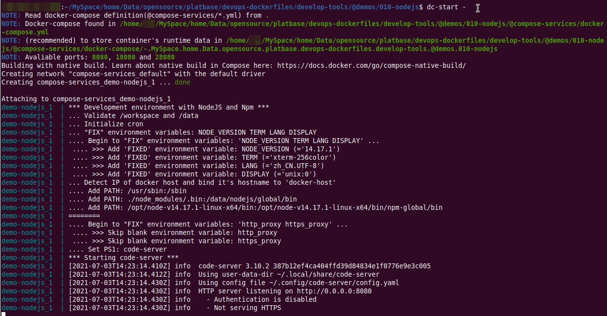

# How to use platbase.com/dev.code-server

`---- As the development environment for Node JS`


## Prepare

See [../../@tools/shell-scripts/README.md](../../@tools/shell-scripts/README.md) for detail.


## How to start

```bash
dc-start -
```




## Developing with code-server

Navigate to http://localhost:8080/?folder=/workspace/ (**NOTE**: Read `dc-start` output to get the **real** code-server port, default is 8080):


