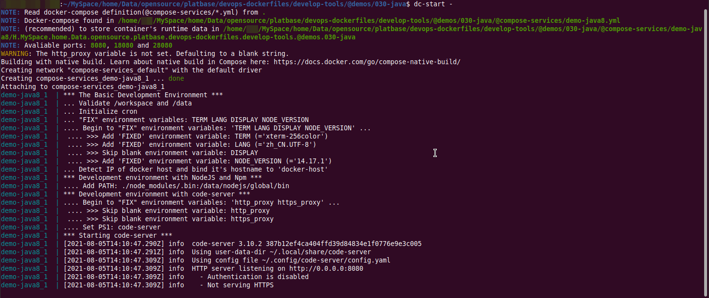
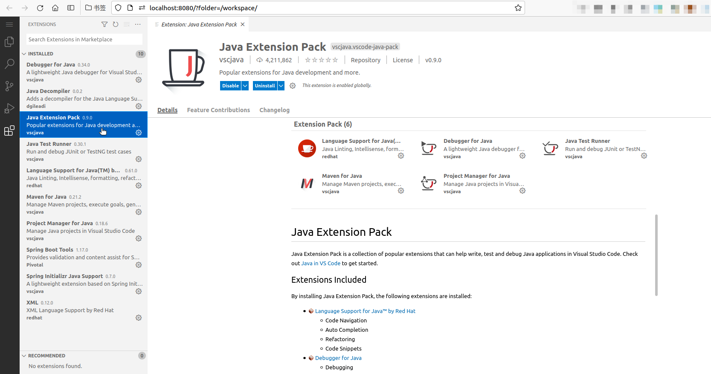
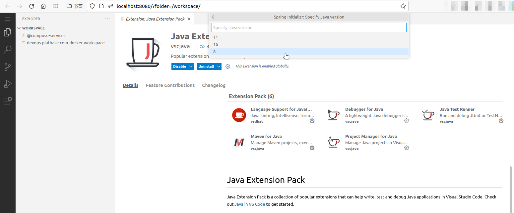
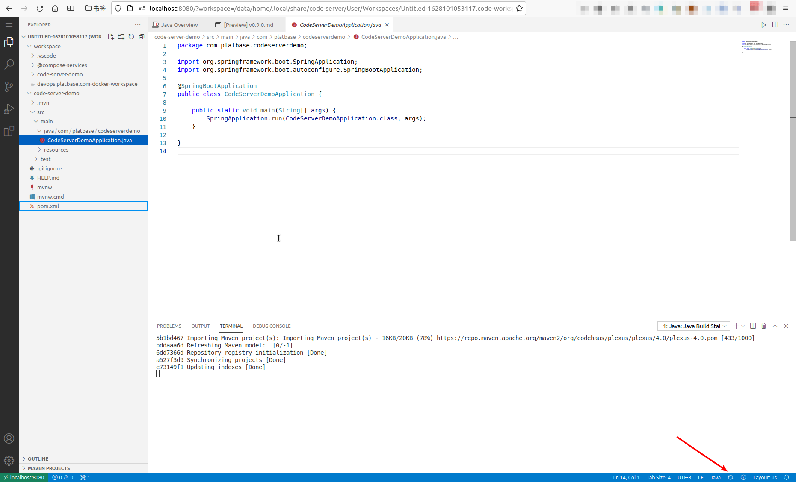

# How to use platbase.com/dev.env-java

`---- As the development environment for The Java Programming Language`


## Prepare

See [../../@tools/shell-scripts/README.md](../../@tools/shell-scripts/README.md) for detail.


## How to start

```bash
dc-start -
```




## Developing with code-server

Navigate to http://localhost:8080/?workspace=/workspace/code-server-demo.code-workspace (**NOTE**: Read `dc-start` output to get the **real** code-server port, default is 8080):


## Reference: Installed plug-ins




## Reference: How to Create Java Project

Following command "Java: Create Java Project..." to build a Java Project:

1. 
2. 
3. 
4. 
5. 
6. 
7. 
8. 
9. 
10. 
11. 
12. 


At the last step, remember to Add Java Project to Workspace:

- 


VS Code should refresh project configuration automatically:

- 


Or update project configuration manually:

- 


Run code when update configuration finished:

- 

